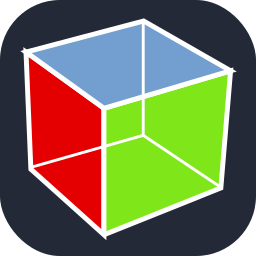
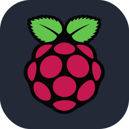
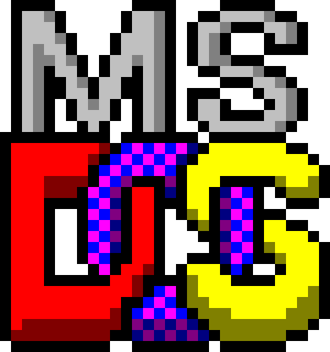

## **Sandroid75**

In 1985 at the age of 10 I received my first computer as a gift: the **Commodore C16**, I remember that it was not as easy to find games for it as it was for the Vic-20 or ZX Spectrum produced by Sinclair or the legendary Commodore C64, so after having desired a Home Computer so much the only thing left for me to do was read the Basic manual that was in the package, reading and testing I had written several simple programs, until I developed a small CAD capable of drawing lines and circles on the screen.

Finally in 1990, following the national lottery statistics on teletext, I played some numbers and won a sum that allowed me to buy my first Personal Computer, it was a 486DX at 33MHz with 4Mb of RAM and  80Mb of very noisly Hard Disk, it was a great PC at that time. So I start to bought from UK books by Hoepli and McGraw Hill, starting to study the architecture of x86 and his logic, so I studying programming in ANSI C. 
I also subscribed to a computer magazine published by Infomedia, its name was Computer Programming, of which I have jealously preserved all pubblications!

My first C compiler was **Turbo C++ Version 1.00 by Borland international**, I developed several programs under MS-DOS 3.3 up to 6.22, below some apps that I remember right now:
- Label printer, for tape musicassette, VHS and CD
- Worksheet manager for Antenna Installator Company
- Parser that extracted and printing addresses of companies reports downloaded from BBS
- Some other code for own purpose

Than in 1994 in order to develop 32-bit apps for AutoCAD 12 in protect-mode (EXP), I was buying **Watcom C/C++ 10.0 Compiler**, I coding up to 1997, than my life was changed growing up as 3D CAD Designer and more and more, but this is another story...

Finally today I coding only for fun!

 

External references:

https://en.wikipedia.org/wiki/Commodore_16

https://en.wikipedia.org/wiki/VIC-20

https://en.wikipedia.org/wiki/Commodore_64

https://en.wikipedia.org/wiki/ZX_Spectrum

https://en.wikipedia.org/wiki/Commodore_BASIC

https://en.wikipedia.org/wiki/I486

https://en.wikipedia.org/wiki/MS-DOS

https://en.wikipedia.org/wiki/Turbo_C%2B%2B

https://en.wikipedia.org/wiki/Watcom_C/C%2B%2B

https://en.wikipedia.org/wiki/Bulletin_board_system

https://cp.infomedia.it/
